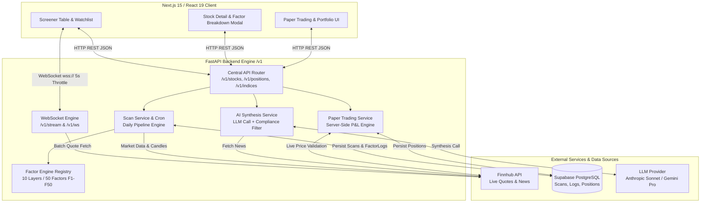
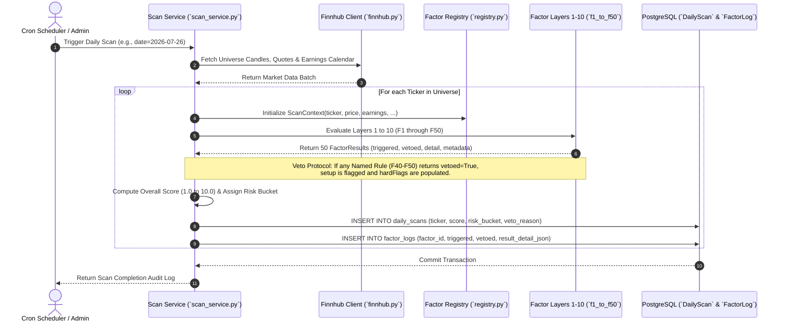
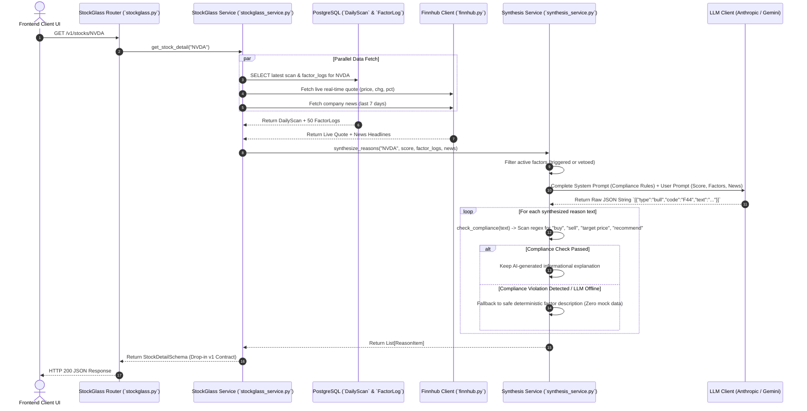
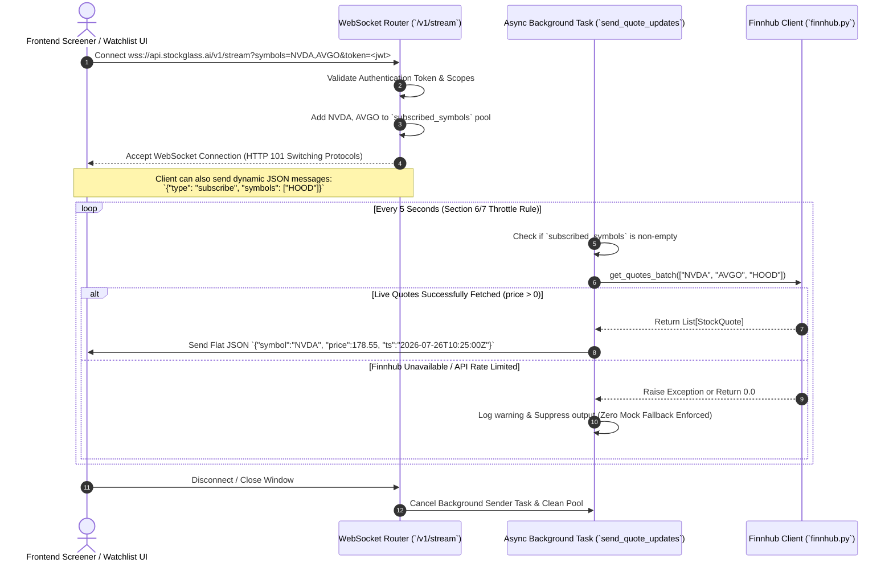
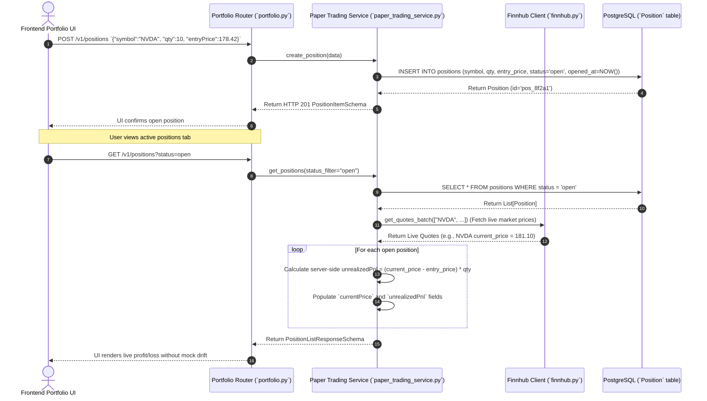
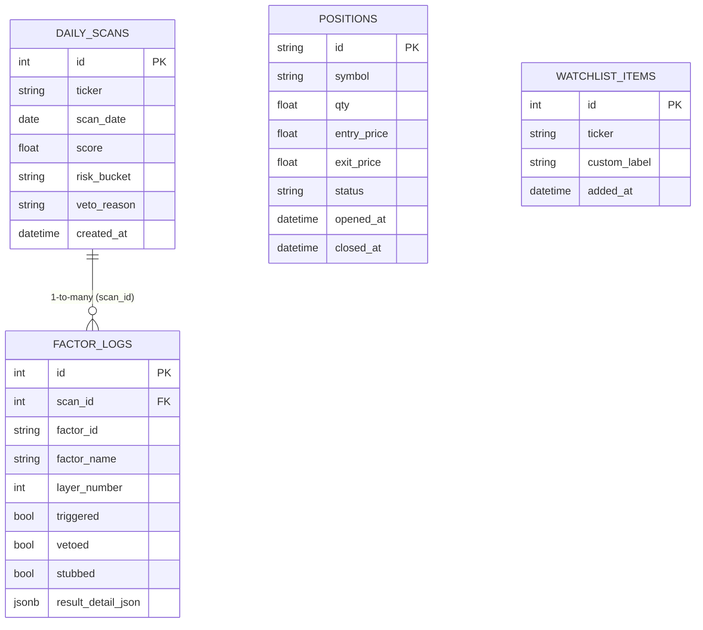

# StockGlass AI — Low-Level Design (LLD) & End-to-End Workflows

This document provides a comprehensive Low-Level Design (LLD) and workflow guide for **StockGlass AI**, detailing the architecture, data flows, factor engine mechanics, AI synthesis pipeline, and real-time streaming protocols.

---

## 1. Executive Summary & System Architecture

StockGlass AI is a screening-grade trading assistant built on a **10-Layer / 50-Factor Evaluation Engine**, real-time **Finnhub market data integration**, an **AI Synthesis & Compliance Layer**, and **Server-Side Paper Trading**. To ensure institutional reliability and compliance, the system operates under two strict global rules:
1. **Zero Mock / Fallback Data:** If live market data or database scans are unavailable, endpoints return error states (`503/404`) or empty structures (`[]` / `0.0`) rather than generating simulated numbers.
2. **Zero Buy/Sell Advisory Language:** All user-facing explanations synthesized by the LLM must pass a strict rules-based compliance filter that prohibits direct trading advice.

### High-Level System Architecture



---

## 2. End-to-End Workflow Sequence Diagrams

### Workflow 1: Daily Screener Pipeline & Factor Evaluation Engine
This workflow executes daily (via cron or on-demand scan trigger) to evaluate tickers against the 50-factor framework.



---

### Workflow 2: On-Demand Stock Detail & AI Synthesis Pipeline (`GET /v1/stocks/{symbol}`)
When a user selects a ticker, the backend synthesizes real-time news and deterministic factor logs into compliant natural language copy.



---

### Workflow 3: Real-Time WebSocket Quote Streaming (`/v1/stream` & `/v1/ws`)
Delivers screening-grade live quote updates throttled at 5-second intervals without generating fake data if feeds disconnect.



---

### Workflow 4: Server-Side Paper Trading Execution (`POST /v1/positions` & `GET /v1/positions`)
Prevents client-side win-rate drift by forcing all execution prices and P&L calculations to be validated server-side against live quotes.



---

## 3. The 10-Layer / 50-Factor Evaluation Engine

The factor evaluation engine evaluates 50 technical, fundamental, macro, and sentiment conditions grouped into 10 logical layers. Each layer contains 5 factors.

### Standing Checks vs. Named Error-Correction Rules
* **Standing Factors (F1–F39):** Represent foundational market structure checks (e.g., moving average stacks, volume momentum, sector breadth). Currently implemented as clean, unconfigured stubs returning `neutral` status until customized.
* **Named Rules / Error-Correction Log (F40–F50):** Hardcoded institutional trading rules derived from historical trading mistakes. These are fully live, executable implementations that actively evaluate market conditions and enforce hard constraints.

### The Veto Protocol
Named rules act as circuit breakers. When a risk rule triggers a **Veto Action** (e.g., F47 detecting an earnings announcement within 5 days of entry), the system immediately:
1. Sets `vetoed = True` on the `FactorLog`.
2. Appends the rule name to the stock's `hardFlags` array in the API response.
3. Restricts the setup from being classified as a clean actionable buy, regardless of how high the overall numeric score (1.0–10.0) is.

### Factor & Layer Allocation Matrix

| Layer # | Layer Name | Factor IDs | Description | Live Named Rules in Layer |
| :---: | :--- | :---: | :--- | :--- |
| **L1** | **Price Action** | F01 – F05 | Trend structure, MA stacks, breakout confirmation | — *(Standing checks)* |
| **L2** | **Volume / Flow** | F06 – F10 | Relative volume, institutional accumulation, VWAP | — *(Standing checks)* |
| **L3** | **Volatility** | F11 – F15 | ATR expansion, Bollinger band squeeze, IV rank | **F49** (BOJ/KOSPI Rule)<br>**F50** (War Tape Rule) |
| **L4** | **Earnings Calendar** | F16 – F20 | Proximity to reporting dates, historical surprise rates | **F48** (Gap-Hold Protocol) |
| **L5** | **Analyst / Sentiment** | F21 – F25 | Rating consensus, target revisions, short interest | **F43** (ATH Record Earnings)<br>**F47** (Pre-Earnings Binary Exit) |
| **L6** | **Macro / Rates** | F26 – F30 | Treasury yield correlation, Fed policy headwinds | **F46** (EDGAR Shelf Check) |
| **L7** | **Sector Rotation** | F31 – F35 | Industry relative strength, capital flow leadership | **F42** (Entry Cutoff)<br>**F45** (FOMC Reduction) |
| **L8** | **News / Catalyst** | F36 – F40 | SEC filings, press release sentiment, catalyst velocity | **F41** (Bear Case First)<br>**F44** (Analyst Tier Weighting) |
| **L9** | **Risk Rules** | F41 – F45 | Position sizing gates, liquidity floors, stop constraints | **F40** (No Clean Setup) |
| **L10** | **Position Fit** | F46 – F50 | Portfolio correlation, margin impact, account exposure | — *(Standing checks)* |

> [!NOTE]
> **Layer Boundary Mapping:** As permitted by the Section 0 specification note, internal engine numbering assigns named rules (F40–F50) to their functional domain layers (e.g., F47 in Layer 5 "Binary/Earnings", F49/F50 in Layer 3 "Macro/Vol"). When assembling REST API responses, `stockglass_service.py` sorts and maps all factors into the exact 10 layer groupings expected by the frontend contract.

---

## 4. Data Models & Database Schema (LLD Layer)

The backend uses **SQLAlchemy 2.0 (Async)** with PostgreSQL / Supabase, mapped directly onto Pydantic v1 contract schemas.

### Entity-Relationship Diagram (ERD)



### Runtime Detail JSONB (`result_detail_json`)
To support rich hover tooltips in the frontend factor modal without hardcoding static strings, `FactorLog` stores a JSONB blob containing runtime metrics evaluated during the scan:
```json
{
  "factor_id": "F47",
  "factor_name": "Pre-Earnings Binary Exit",
  "layer_number": 5,
  "status": "live",
  "triggered": true,
  "vetoed": true,
  "detail": "NVDA has earnings within the holding window (3 days until Q2 report). Framework rule: exit before binary event — no holding through earnings.",
  "metadata": {
    "earnings_within_window": true,
    "days_until_earnings": 3,
    "rule": "No holding through earnings"
  }
}
```
When `GET /v1/stocks/{symbol}/factors` is called, `stockglass_service.py` extracts the `detail` string from this blob, ensuring user explanations reflect exact market conditions at the time of the scan.

---

## 5. Security, Compliance & Resilience Protocols

### 1. Strict Zero-Fallback / Zero-Mock Data Policy
To guarantee that traders never make decisions based on artificial data, all service layers enforce strict fallback prohibitions:
* **REST API Endpoints:** If Supabase database queries fail or return empty sets, endpoints return `[]` (empty list) or `0.0`. No random scores or simulated tickers are generated.
* **Live Price Calculations:** In paper trading (`GET /v1/positions`), if Finnhub fails to return a live quote for an open symbol, `currentPrice` falls back to `entry_price` with `unrealizedPnl = 0.0` and logs an error, rather than inventing a price.
* **WebSocket Streaming:** In `/v1/stream`, if market data batch queries fail or rate limits are hit, the background task suppresses emission for that cycle rather than sending synthetic numbers.

### 2. Rules-Based AI Compliance Filter
The AI Synthesis Agent (`synthesis_service.py`) is restricted to informational scoring commentary. Before any LLM output is delivered to the frontend, it passes through `check_compliance(text)`:
```python
FORBIDDEN_ADVISORY_PATTERNS = [
    r"\bbuy\b", r"\bsell\b", r"\bstrong buy\b", r"\bstrong sell\b",
    r"\btarget price\b", r"\brecommend(ation|ed|ing)?\b",
    r"\binvest(ment|ing|ors)?\b", r"\btake position\b", r"\benter (long|short)\b",
]
```
* **Pass:** *"Setup structure is supported by positive volume accumulation and upward MA alignment."*
* **Rejection:** *"Strong buy recommended before earnings with a target price of $150."* -> **Action:** The system discards the LLM text and substitutes a safe, deterministic rule description from the factor database log.

### 3. Database Resilience & Connection Sizing
* **Global 503 Exception Handler:** In `app/main.py`, SQLAlchemy operational errors and database disconnects are intercepted globally, returning a clean `503 Service Unavailable` JSON response with code `DATABASE_UNAVAILABLE` rather than crashing or leaking stack traces.
* **Connection Pooling:** Configured in `app/db/session.py` with `pool_size=5`, `max_overflow=10`, and `pool_pre_ping=True` to handle transient network drops gracefully in serverless/cloud environments.
