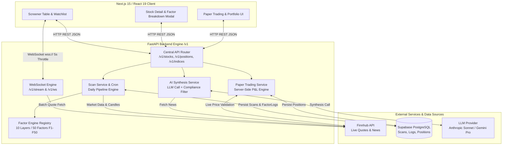
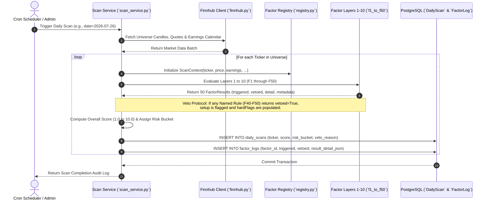
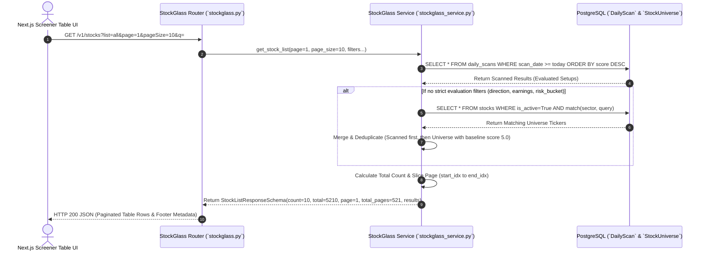
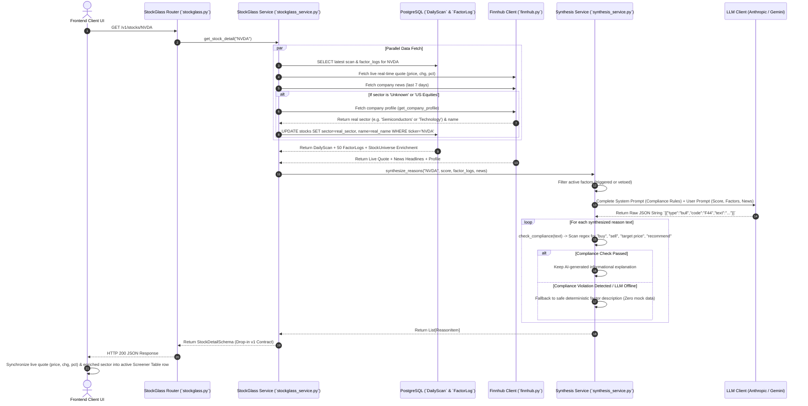
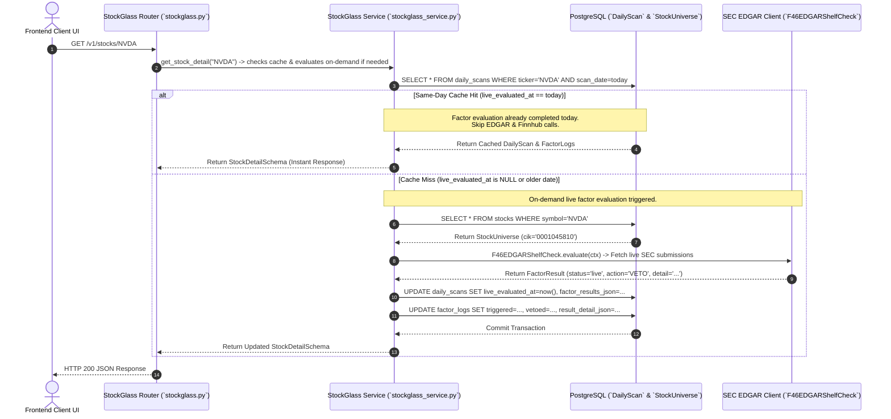
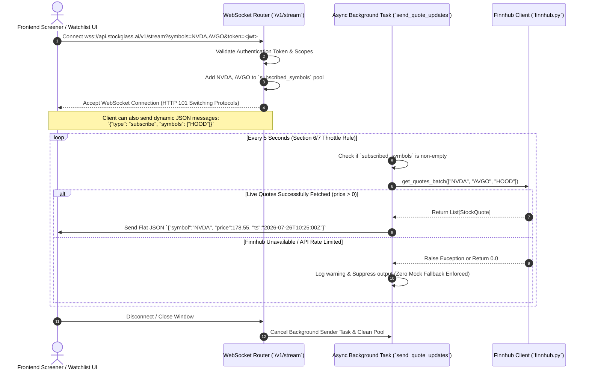
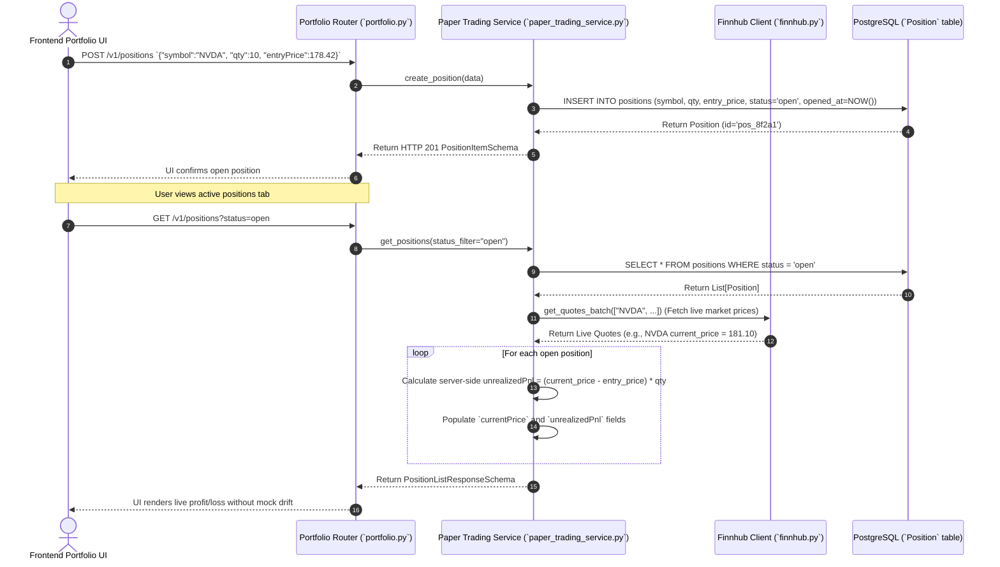
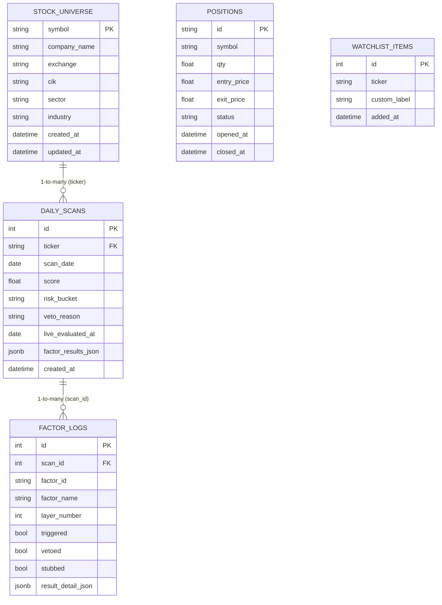

# StockGlass AI — Low-Level Design (LLD) & End-to-End Workflows

This document provides a comprehensive Low-Level Design (LLD) and workflow guide for **StockGlass AI**, detailing the architecture, data flows, factor engine mechanics, AI synthesis pipeline, and real-time streaming protocols.

---

## 1. Executive Summary & System Architecture

StockGlass AI is a screening-grade trading assistant built on a **10-Layer / 50-Factor Evaluation Engine**, real-time **Finnhub market data integration**, an **AI Synthesis & Compliance Layer**, and **Server-Side Paper Trading**. To ensure institutional reliability and compliance, the system operates under two strict global rules:
1. **Zero Mock / Fallback Data:** If live market data or database scans are unavailable, endpoints return error states (`503/404`) or empty structures (`[]` / `0.0`) rather than generating simulated numbers.
2. **Zero Buy/Sell Advisory Language:** All user-facing explanations synthesized by the LLM must pass a strict rules-based compliance filter that prohibits direct trading advice.

### High-Level System Architecture



---

## 2. End-to-End Workflow Sequence Diagrams

### Workflow 1: Daily Screener Pipeline & Factor Evaluation Engine
This workflow executes daily (via cron or on-demand scan trigger) to evaluate tickers against the 50-factor framework.



---

### Workflow 1B: Screener Pagination & Universe Supplementation (`GET /v1/stocks`)
When the frontend dashboard requests screener setups, the backend combines evaluated DailyScan results with the full 10,419-stock database universe (`StockUniverse`), applying server-side pagination (`page`, `pageSize`) and exact filtering.



---

### Workflow 2: On-Demand Stock Detail & AI Synthesis Pipeline (`GET /v1/stocks/{symbol}`)
When a user selects a ticker, the backend synthesizes real-time news and deterministic factor logs into compliant natural language copy.



---

### Workflow 2B: On-Demand Live Factor Evaluation & Same-Day Caching (`GET /v1/stocks/{symbol}/live`)
To prevent unnecessary re-execution of heavy EDGAR SEC lookups and Finnhub API calls when a user views a stock multiple times in the same day, the system implements a **Same-Day Database Caching Protocol**.



---

### Workflow 3: Real-Time WebSocket Quote Streaming (`/v1/stream` & `/v1/ws`)
Delivers screening-grade live quote updates throttled at 5-second intervals without generating fake data if feeds disconnect.



---

### Workflow 4: Server-Side Paper Trading Execution (`POST /v1/positions` & `GET /v1/positions`)
Prevents client-side win-rate drift by forcing all execution prices and P&L calculations to be validated server-side against live quotes.



---

## 3. The 10-Layer / 50-Factor Evaluation Engine

The factor evaluation engine evaluates 50 technical, fundamental, macro, and sentiment conditions grouped into 10 logical layers. Each layer contains 5 factors.

### Standing Checks vs. Named Error-Correction Rules
* **Standing Factors (F1–F39):** Represent foundational market structure checks (e.g., moving average stacks, volume momentum, sector breadth). Currently implemented as clean, unconfigured stubs returning `neutral` status until customized.
* **Named Rules / Error-Correction Log (F40–F50):** Hardcoded institutional trading rules derived from historical trading mistakes. These are fully live, executable implementations that actively evaluate market conditions and enforce hard constraints.

### The Veto Protocol
Named rules act as circuit breakers. When a risk rule triggers a **Veto Action** (e.g., F47 detecting an earnings announcement within 5 days of entry), the system immediately:
1. Sets `vetoed = True` on the `FactorLog`.
2. Appends the rule name to the stock's `hardFlags` array in the API response.
3. Restricts the setup from being classified as a clean actionable buy, regardless of how high the overall numeric score (1.0–10.0) is.

### Factor & Layer Allocation Matrix

| Layer # | Layer Name | Factor IDs | Description | Live Named Rules in Layer |
| :---: | :--- | :---: | :--- | :--- |
| **L1** | **Price Action** | F01 – F05 | Trend structure, MA stacks, breakout confirmation | — *(Standing checks)* |
| **L2** | **Volume / Flow** | F06 – F10 | Relative volume, institutional accumulation, VWAP | — *(Standing checks)* |
| **L3** | **Volatility** | F11 – F15 | ATR expansion, Bollinger band squeeze, IV rank | **F49** (BOJ/KOSPI Rule)<br>**F50** (War Tape Rule) |
| **L4** | **Earnings Calendar** | F16 – F20 | Proximity to reporting dates, historical surprise rates | **F48** (Gap-Hold Protocol) |
| **L5** | **Analyst / Sentiment** | F21 – F25 | Rating consensus, target revisions, short interest | **F43** (ATH Record Earnings)<br>**F47** (Pre-Earnings Binary Exit) |
| **L6** | **Macro / Rates** | F26 – F30 | Treasury yield correlation, Fed policy headwinds | **F46** (EDGAR Shelf Check) |
| **L7** | **Sector Rotation** | F31 – F35 | Industry relative strength, capital flow leadership | **F42** (Entry Cutoff)<br>**F45** (FOMC Reduction) |
| **L8** | **News / Catalyst** | F36 – F40 | SEC filings, press release sentiment, catalyst velocity | **F41** (Bear Case First)<br>**F44** (Analyst Tier Weighting) |
| **L9** | **Risk Rules** | F41 – F45 | Position sizing gates, liquidity floors, stop constraints | **F40** (No Clean Setup) |
| **L10** | **Position Fit** | F46 – F50 | Portfolio correlation, margin impact, account exposure | — *(Standing checks)* |

> [!NOTE]
> **Layer Boundary Mapping:** As permitted by the Section 0 specification note, internal engine numbering assigns named rules (F40–F50) to their functional domain layers (e.g., F47 in Layer 5 "Binary/Earnings", F49/F50 in Layer 3 "Macro/Vol"). When assembling REST API responses, `stockglass_service.py` sorts and maps all factors into the exact 10 layer groupings expected by the frontend contract.

---

## 4. Data Models & Database Schema (LLD Layer)

The backend uses **SQLAlchemy 2.0 (Async)** with PostgreSQL / Supabase, mapped directly onto Pydantic v1 contract schemas.

### Entity-Relationship Diagram (ERD)



### The Same-Day Database Caching Protocol (`live_evaluated_at`)
To optimize API latency and rate-limit consumption for heavy institutional checks (such as SEC EDGAR F46 dilution checks):
1. **Initial Seed & Morning Scan:** Tickers are loaded from `stocks` (StockUniverse) and scanned daily. During the initial morning batch scan, `live_evaluated_at` is set to `NULL` for on-demand factors.
2. **First User View (Cache Miss):** When `GET /v1/stocks/{symbol}/live` is invoked, the service checks if `live_evaluated_at` matches today's UTC date. If not, it executes real-time EDGAR lookups using the CIK from `stocks`, updates `FactorLog` records, and sets `live_evaluated_at = today`.
3. **Subsequent Views (Cache Hit):** Any subsequent requests for the same ticker on the same day detect `live_evaluated_at == today` and immediately return the cached factor evaluations without external API calls.

### Runtime Detail JSONB (`result_detail_json`)
To support rich hover tooltips in the frontend factor modal without hardcoding static strings, `FactorLog` stores a JSONB blob containing runtime metrics evaluated during the scan:
```json
{
  "factor_id": "F47",
  "factor_name": "Pre-Earnings Binary Exit",
  "layer_number": 5,
  "status": "live",
  "triggered": true,
  "vetoed": true,
  "detail": "NVDA has earnings within the holding window (3 days until Q2 report). Framework rule: exit before binary event — no holding through earnings.",
  "metadata": {
    "earnings_within_window": true,
    "days_until_earnings": 3,
    "rule": "No holding through earnings"
  }
}
```
When `GET /v1/stocks/{symbol}/factors` is called, `stockglass_service.py` extracts the `detail` string from this blob, ensuring user explanations reflect exact market conditions at the time of the scan.

---

## 5. Security, Compliance & Resilience Protocols

### 1. Strict Zero-Fallback / Zero-Mock Data Policy
To guarantee that traders never make decisions based on artificial data, all service layers enforce strict fallback prohibitions:
* **REST API Endpoints:** If Supabase database queries fail or return empty sets, endpoints return `[]` (empty list) or `0.0`. No random scores or simulated tickers are generated.
* **Live Price Calculations:** In paper trading (`GET /v1/positions`), if Finnhub fails to return a live quote for an open symbol, `currentPrice` falls back to `entry_price` with `unrealizedPnl = 0.0` and logs an error, rather than inventing a price.
* **WebSocket Streaming:** In `/v1/stream`, if market data batch queries fail or rate limits are hit, the background task suppresses emission for that cycle rather than sending synthetic numbers.

### 2. Rules-Based AI Compliance Filter
The AI Synthesis Agent (`synthesis_service.py`) is restricted to informational scoring commentary. Before any LLM output is delivered to the frontend, it passes through `check_compliance(text)`:
```python
FORBIDDEN_ADVISORY_PATTERNS = [
    r"\bbuy\b", r"\bsell\b", r"\bstrong buy\b", r"\bstrong sell\b",
    r"\btarget price\b", r"\brecommend(ation|ed|ing)?\b",
    r"\binvest(ment|ing|ors)?\b", r"\btake position\b", r"\benter (long|short)\b",
]
```
* **Pass:** *"Setup structure is supported by positive volume accumulation and upward MA alignment."*
* **Rejection:** *"Strong buy recommended before earnings with a target price of $150."* -> **Action:** The system discards the LLM text and substitutes a safe, deterministic rule description from the factor database log.

### 3. Database Resilience & Connection Sizing
* **Global 503 Exception Handler:** In `app/main.py`, SQLAlchemy operational errors and database disconnects are intercepted globally, returning a clean `503 Service Unavailable` JSON response with code `DATABASE_UNAVAILABLE` rather than crashing or leaking stack traces.
* **Connection Pooling:** Configured in `app/db/session.py` with `pool_size=5`, `max_overflow=10`, and `pool_pre_ping=True` to handle transient network drops gracefully in serverless/cloud environments.

### 4. Streamlined Scan Status Lifecycle & Immediate Execution Accessibility
To provide a frictionless user experience for institutional traders and eliminate unnecessary speed bumps (FR-7 / FR-16 streamlining):
* **Auto-Confirmation of Valid Scans:** Any stock that successfully passes the 50-factor deterministic evaluation without triggering a mandatory veto rule initializes directly in `CONFIRMED` status (rather than requiring a manual TradingView screenshot upload to transition from `PENDING_CONFIRMATION`).
* **Immediate Execution Details:** Because valid setups initialize as `CONFIRMED`, execution details (`entry_price`, `strike_price`, `stop_loss`) are immediately accessible to the user in the UI dashboard and authorized for explanation by the AI Assistant in the chat panel.
* **Veto / Cutoff Locking:** If a setup triggers an active veto rule (e.g., F40 No Clean Setup or F46 Dilution) or is evaluated after the institutional entry cutoff time, its status is strictly set to `LOCKED`, withholding execution details and preventing actionable trades.

### 5. Complete AI Context Injection & Automated Options Contract Selection
To ensure institutional-grade explanations and strict compliance with the Zero-Mock Data policy:
* **Automated Options Contract Selector (`options_service.py`):** In strict adherence to the prohibition against simulated data, strike prices are never calculated using arbitrary percentage multipliers (e.g., flat 5% OTM heuristics). `options_service.py` integrates with `yfinance` to automatically query real exchange option chains and select institutional Call/Put contracts matching target Delta (~0.30 to 0.45) and expiration windows (30–45 DTE). When a live options chain feed is unavailable, `strike_price` evaluates to `NULL` (`None`) and renders as `"N/A - Requires Live Options Chain Feed"`.
* **Local Vectorized Technical Indicator Engine (`technicals.py`):** Technical indicators (RSI, SMA 50/200) are computed locally using vectorized `pandas`/`numpy` math on daily OHLCV bars fetched via `yfinance` and Finnhub, eliminating external indicator rate limits while ensuring precision and reproducibility.

### 6. AI News Catalyst Synthesis & Zero-Mock News Policy
To provide traders with institutional clarity on market narratives without risking simulated or advisory content:
* **Concurrent Catalyst Synthesis:** When a user opens the Stock Detail view (`GET /v1/stocks/{symbol}`), the backend concurrently executes `synthesize_reasons` (for score bullets) and `synthesize_news_summary` (for full narrative summary) via `asyncio.gather`.
* **Institutional Catalyst Summary:** `synthesize_news_summary` feeds up to 5 recent news articles (headlines, summaries, sources) from Finnhub directly to the LLM to generate an objective, 2-sentence institutional summary of the market narrative, fundamental catalyst, or macroeconomic impact. `NewsItemSchema` explicitly includes `summary: Optional[str]` to guarantee end-to-end data integrity.
* **Strict Compliance & Zero-Mock Fallback:** All generated summaries must pass `check_compliance(text)`. If an article feed is empty, the LLM is offline, or compliance rejects the text, `newsSummary` evaluates to `null` (`None`) without generating simulated summaries or mock market stories. The UI displays an italicized notification or hides the box cleanly.

---

## 10. Agentic AI Architecture — Chat Agent & Autonomous Scan Triggering

### Overview
StockGlass AI uses a **Single-Node Agentic Architecture** built natively on the Anthropic/Gemini SDK (no LangChain, no CrewAI). The Chat Agent operates on a **ReAct (Reason + Act) loop**: it receives a user query, decides if it needs live data, autonomously triggers Python Tool functions, reads the results, and formulates the final response.

### Agent Tools (Function Calling)
The agent (`app/agents/chat_agent.py`) has access to the following tools:

| Tool | Purpose |
|---|---|
| `get_scan_results` | Fetch today's scanned tickers from DB filtered by status / risk bucket |
| `explain_ticker` | Deep-explain why a ticker was ranked or vetoed by specific framework rules |
| `apply_ui_filter` | Apply real-time filter on the screener table (e.g., "show only LOW risk") |
| `trigger_scan` | **Autonomously trigger the full 50-factor / 10-layer scan for today** |

### Proactive Scan Trigger Behaviour
When the agent detects that today's scan dataset is **empty** (`scan_empty=True`):
1. The agent proactively informs the user: *"No scan data found for today. Would you like me to trigger the full 50-factor scan now?"*
2. The agent **never** triggers the scan automatically — it always asks for explicit user confirmation first.
3. When the user confirms (e.g., *"yes", "run it", "go ahead"*), the agent calls `trigger_scan(confirmed=True)`.
4. The agent streams real-time feedback: ⚙️ starting → ✅ complete with ticker counts.
5. The user is instructed to refresh the screener table to see the newly populated results.

### Why No Automatic Scheduler?
The backend is hosted on **Hugging Face Spaces free tier (CPU basic)**, which sleeps after ~15 minutes of inactivity. An internal `APScheduler` set to 6:30 AM CST would be unreliable because the Space will likely be sleeping at that time. The Agentic "on-demand with confirmation" model is the correct, reliable solution for free-tier cloud deployments.

### GenAI Components
| Component | File | Model | Purpose |
|---|---|---|---|
| Chat Agent Orchestrator | `app/agents/chat_agent.py` | Gemini / Claude | ReAct loop, tool calling, streaming responses |
| News Synthesis Agent | `app/services/synthesis_service.py` | Gemini / Claude | Unstructured news → structured Bull/Bear bullets |
| Vision AI Options Extractor | `app/api/screenshots.py` | Gemini Vision / Claude Vision | Screenshot → structured options chain JSON |

---

## 11. Deployment Architecture

### Cloud Stack
| Layer | Platform | Notes |
|---|---|---|
| **Backend** | Hugging Face Spaces (CPU Basic) | Dockerized FastAPI on port 7860, public access required |
| **Frontend** | Vercel (Next.js) | Edge-deployed; `NEXT_PUBLIC_API_URL` env var must be set to HF URL |
| **Database** | Supabase (PostgreSQL) | `DATABASE_URL` secret set in HF Spaces Variables |

### Critical Deployment Notes
* **HF Space must be PUBLIC:** The frontend (Vercel) makes direct browser `fetch()` calls to the HF backend. If the Space is Private, HF intercepts all unauthenticated requests and returns an HTML 404 page, breaking the API.
* **API_SECRET_KEY must be set in HF Secrets:** The frontend sends `X-API-Key: dev_key` on every request. The backend validates this against `API_SECRET_KEY` from environment. If missing, the backend falls back to `"change-me-in-production"` which causes 401 errors.
* **Trailing newlines in HF secrets:** Pasting secrets manually in the HF UI often appends `\n`. The `DATABASE_URL` field validator in `config.py` strips these automatically using `@field_validator`.
* **`/chat` POST trailing slash:** FastAPI's trailing-slash redirect (307) on `POST /chat/` converts POST to GET, breaking the SSE stream. Both `@router.post("")` and `@router.post("/")` are registered to prevent this.
* **Versioned API namespace:** All production REST endpoints are exposed under `/v1/...` only.
    Root fallback aliases (such as `/stocks`, `/chat`, `/watchlist`, `/debug`, `/auth`) are intentionally disabled to enforce a single stable contract.
* **CORS:** `allow_origin_regex` covers `*.vercel.app` and `*.hf.space` wildcard domains for all preview and production deployments.

### Required Hugging Face Secrets
| Secret Name | Value | Required? |
|---|---|---|
| `DATABASE_URL` | `postgresql+asyncpg://...` from Supabase | ✅ Yes |
| `API_SECRET_KEY` | `dev_key` (match frontend `X-API-Key`) | ✅ Yes |
| `GEMINI_API_KEY` | Google Gemini API key | ✅ For GenAI features |
| `FINNHUB_API_KEY` | Finnhub API key | ✅ For market data |
| `ALPHA_VANTAGE_API_KEY` | Alpha Vantage key | ✅ For technicals |

---

## 12. Scan Pipeline — Design & Fixes (2026-07-28)

### How the Scan Pipeline Works

1. **Trigger**: `POST /v1/scans/trigger` (or via AI chat tool `trigger_scan`) calls `scan_service.trigger_scan()`.
2. **Earnings Calendar**: Fetches today's earnings list from Finnhub (`/calendar/earnings?from=DATE&to=DATE`).
3. **Rolling Offset / Pagination**: Before slicing, the service queries the `daily_scans` table to find which tickers have already been scanned today. It skips those and takes the **next `batch_size` (default 20)** unseen tickers.
4. **Concurrent Fetch**: For each ticker in the batch, it concurrently fetches quote, technicals, and company profile (5-at-a-time semaphore to respect free-tier rate limits).
5. **Safety Guard**: If Finnhub returns 0 tickers (API error / no data), the scan **aborts early** and returns `status: ABORTED_NO_DATA` — it never wipes existing database records.
6. **Scoring**: `run_full_scan()` evaluates all 50 factors across 10 layers for each ticker.
7. **Incremental Persist**: Only the new batch's tickers are deleted and re-inserted — not the entire day's data.
8. **Commit**: `session.commit()` is called at the end to permanently save all rows to Supabase.
9. **All Done**: When all tickers in the calendar are scanned, returns `status: ALL_SCANNED`.

### Key Files
| File | Role |
|---|---|
| `backend/app/services/scan_service.py` | Core scan pipeline, offset pagination, DB persistence |
| `backend/app/api/scans.py` | REST endpoints (`POST /trigger`, `GET /{date}`) |
| `backend/app/agents/chat_agent.py` | AI tool executor — triggers scan via chat, offloads to `asyncio.create_task` |

### Bug Fixes Applied
| Bug | Symptom | Fix |
|---|---|---|
| `session.flush()` instead of `session.commit()` | Scan ran successfully but no rows saved to DB | Changed final flush to `session.commit()` |
| Gemini tool args not saved to `current_tool_name` | Tool call detected by frontend but silently never executed | Fixed Gemini streaming branch to always set `current_tool_name` before yielding |
| `confirmed is True` strict bool check | Gemini passes `"true"` string; scan was silently cancelled | Relaxed to check `str(val).lower() in ["true","yes","1"]` |
| `asyncio.create_task()` GC'd immediately | Background scan task destroyed before running | Added module-level `_bg_tasks` set to hold strong reference |
| Full `DELETE` before incremental insert | Re-running scan wiped all existing data for the day | Changed to `DELETE WHERE ticker IN (batch)` |
| Always scanning first 20 tickers | Repeated scans scanned same stocks over and over | Implemented offset from DB — each run skips already-scanned tickers |
| `UnboundLocalError: scan_empty` | Hard crash in SSE stream | Moved variable initialization outside `for` loop |
| SQL date boundary bug (days 28–31) | `get_scan_results` returned empty for late-month dates | Replaced hardcoded day math with `timedelta(days=1)` |
| `ConnectionDoesNotExistError` (asyncpg) | Scan crashed mid-write after 30–90s of Finnhub API calls | Refactored to use three short-lived sessions: (1) quick read at start, (2) no session held during Finnhub work, (3) fresh write session at end |

---

## 13. Dual-Horizon Selection Framework (2026-08-01)

### Objective
The scan pipeline now computes two independent selection outputs from the same live data snapshot:
1. **30-Day Tactical Engine** (catalyst + setup + options mechanics, gated by macro regime checks).
2. **Long-Term Investment Engine** (business quality + valuation readiness with strict data availability checks).

This design prevents short-term catalyst positioning from contaminating long-term conviction sizing.

### Implementation Files
| File | Change |
|---|---|
| `backend/app/framework/dual_horizon.py` | Added tactical and long-term evaluators and output contract builders |
| `backend/app/services/fundamentals_service.py` | Added live fundamentals ingestion (`yfinance`) for long-term engine inputs |
| `backend/app/framework/factors/base.py` | Extended `ScanContext` with typed fundamentals fields |
| `backend/app/framework/engine.py` | Mapped fundamentals fields from ticker payload into `ScanContext` |
| `backend/app/services/scan_service.py` | Persisted dual-horizon payload into `daily_scans.factor_results_json.dual_horizon` |
| `backend/app/services/stockglass_service.py` | Exposed dual-horizon payload in stock list/detail and built dedicated dual-list response |
| `backend/app/api/stockglass.py` | Added route: `GET /v1/stocks/dual-horizon` |
| `backend/app/db/schemas.py` | Added dual-horizon API schemas |

### New API Route
`GET /v1/stocks/dual-horizon`

Response model: `DualHorizonListResponseSchema`

```json
{
    "scanDate": "2026-08-01",
    "tacticalCount": 27,
    "longTermCount": 11,
    "tactical": [
        {
            "symbol": "NVDA",
            "name": "NVIDIA Corporation",
            "sector": "Semiconductors",
            "score": 8.1,
            "sizingCap": "100%",
            "regimeGate": "PASS"
        }
    ],
    "longTerm": [
        {
            "symbol": "MSFT",
            "name": "Microsoft Corporation",
            "sector": "Technology",
            "score": 7.4,
            "sizingCap": null,
            "regimeGate": null
        }
    ]
}
```

### Persisted Runtime Schema (`daily_scans.factor_results_json.dual_horizon`)
```json
{
    "tactical": {
        "score": 7.3,
        "regime_gate_pass": true,
        "regime_fail_reasons": [],
        "catalyst_signals": ["EARNINGS_WINDOW"],
        "technical_signals": ["PRICE_ABOVE_SMA50"],
        "options_signals": ["OPTION_CONTRACT_AVAILABLE"],
        "conviction_tier": "FULL_SIZE",
        "sizing_cap": "100%",
        "entry_cutoff": "11:00 AM CST (10:30 AM CST Fridays)",
        "binary_event_exit": "EXIT_BEFORE_EARNINGS_UNLESS_EXPLICIT_OVERRIDE",
        "invalidation_rule": "SET_AT_ENTRY_NO_EMOTIONAL_OVERRIDE"
    },
    "long_term": {
        "status": "SCORED",
        "score": 6.9,
        "thesis_strength_score": 7.2,
        "entry_timing_score": 6.0,
        "portfolio_fit_score": 6.0,
        "missing_inputs": [],
        "thesis_break_condition": "FUNDAMENTAL_THESIS_BREAK_ONLY"
    }
}
```

### Validation & Error Behavior
1. **No synthetic fundamentals:** If fundamentals are missing from live feed, each missing field is explicitly listed in `long_term.missing_inputs`.
2. **Long-term score suppression:** If required long-term inputs are incomplete, status is `DATA_NOT_AVAILABLE` and long-term score is `null`.
3. **Regime hard gate:** Tactical candidates with triggered `F45`, `F49`, `F50`, or post-cutoff state fail regime gate and are excluded from tactical list output.
4. **Legacy list compatibility:** `daily_scans.list_type` remains populated for compatibility; dual-horizon list consumption should use `GET /v1/stocks/dual-horizon` as source of truth.

### Routing Note (2026-08-01)
`/v1/scans/trigger` is the canonical and only supported scan trigger route.
The root alias `/scans/trigger` was removed to prevent duplicate endpoint exposure.


